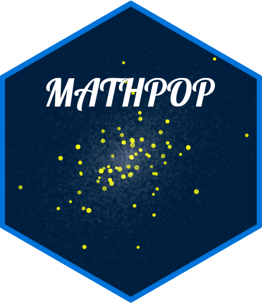

# MATHPOP

The MATHPOP project is an `R` software developed to help astrophysicists infer globular cluster counts and their luminosity functions in Ultra-Diffuse Galaxies. This repo contains the source code and various analysis files for the MATHPOP project.

For more details, please see the [MATHPOP][] webpage for a simple tutorial and all `RMarkdown` files to reproduce the results in the original MATHPOP paper.

The main source code is contained in the `code/` folder. `data/` folder contains example data used in the MATHPOP paper and other post-inference data. `source/` folder contains old-version source code used to obtain results in the original paper.

For bugs report, trouble-shooting, or questions, please open an [issue][].

## Attribution

MATHPOP was developed, and is maintained by David Li, a Ph.D. candidate in the [Astrostatistics Research Team (ART)][] and the [Department of Statistical Sciences][] at [The University of Toronto][]. He is funded by the [Canadian Statistical Sciences Institute (CANSSI)][] under a [CANSSI Multi-disciplinary Doctoral Trainee Program][], and a [Doctoral Fellow][] in the [Data Sciences Institute (DSI)][].

MATHPOP is available under the [GNU GPL-v3.0][] license. For proper attribution, please cite the original MATHPOP paper that describes the method:

> Li et al. (2024) "Discovery of Two Ultra-Diffuse Galaxies with Unusually Bright Globular Cluster Luminosity Functions via a Mark-Dependently Thinned Point Process (MATHPOP)", submitted to the Astrophysical Journal.

An `R` package is currently under development, and will be made publicly available at this repo as well as CRAN upon publication of the original MATHPOP paper.

This project is generated using the [workflowr][] package.

[workflowr]: https://github.com/workflowr/workflowr
[MATHPOP]: http://ddavidli.com/MATHPOP/
[issue]: https://github.com/davidolohowski/MATHPOP/issues
[Astrostatistics Research Team (ART)]: https://astrostatuoft.com/
[Department of Statistical Sciences]: https://www.statistics.utoronto.ca/
[The University of Toronto]: https://www.utoronto.ca/
[Canadian Statistical Sciences Institute (CANSSI)]: https://canssi.ca/
[CANSSI Multi-disciplinary Doctoral Trainee Program]: https://canssiontario.utoronto.ca/opportunities/uoft-opportunities/mdoc/
[Doctoral Fellow]: https://datasciences.utoronto.ca/doctoral-student-fellowship/
[Data Sciences Institute (DSI)]: https://datasciences.utoronto.ca/
[GNU GPL-v3.0]: https://www.gnu.org/licenses/gpl-3.0.en.html

